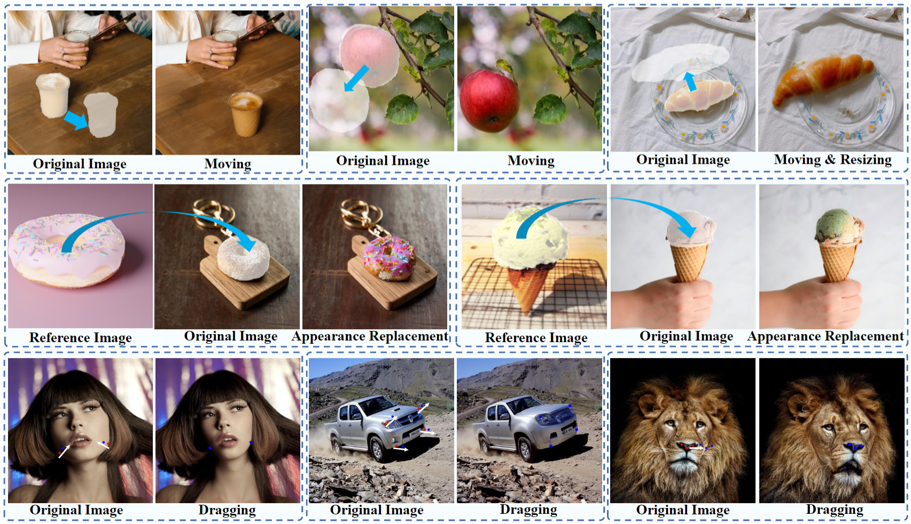
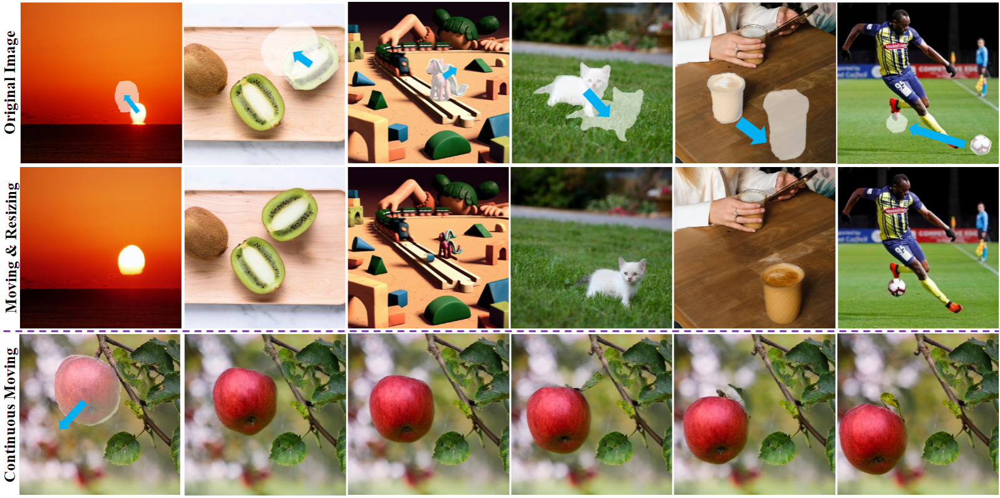
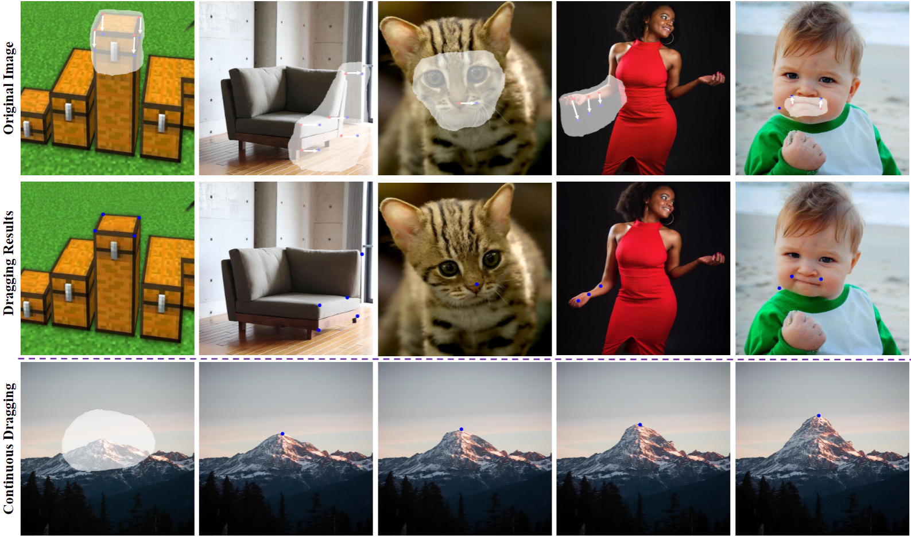

# DragonDiffusion: Enabling Drag-style Manipulation on Diffusion Models
[Chong Mou](https://scholar.google.com/citations?user=SYQoDk0AAAAJ&hl=zh-CN),
[Xintao Wang](https://xinntao.github.io/),
[Jiechong Song](),
[Ying Shan](https://scholar.google.com/citations?user=4oXBp9UAAAAJ),
[Jian Zhang](https://jianzhang.tech/)

---

  

DragonDiffusion enables various editing modes for the real images, including object moving, object resizing, object appearance replacement, and content dragging.

## Updates

- [2023/7/6] Paper is available [here](https://arxiv.org/abs/2307.02421).

---

## Introduction
In this paper, we aim to develop a fine-grained image editing scheme based on the strong correspondence of intermediate features in diffusion models. To this end, we design a classifier-guidance-based method to transform the editing signals into gradients via feature correspondence loss to modify the intermediate representation of the diffusion model. The feature correspondence loss is designed with multiple scales to consider both semantic and geometric alignment. Moreover, a cross-branch self-attention is added to maintain the consistency between the original image and the editing result.

## Main Features

- Object Moving & Resizing

  

- Object Appearance Replacement

  

- Content Dragging

  

## Related Works
[1] <a href="https://github.com/XingangPan/DragGAN">Drag Your GAN: Interactive Point-based Manipulation on the Generative Image Manifold</a>

[2] <a href="https://yujun-shi.github.io/projects/dragdiffusion.html">DragDiffusion: Harnessing Diffusion Models for Interactive Point-based Image Editing</a> (The first attempt and presentation for point dragging on diffusion)

[3] <a href="https://dave.ml/selfguidance/">Diffusion Self-Guidance for Controllable Image Generation</a>

